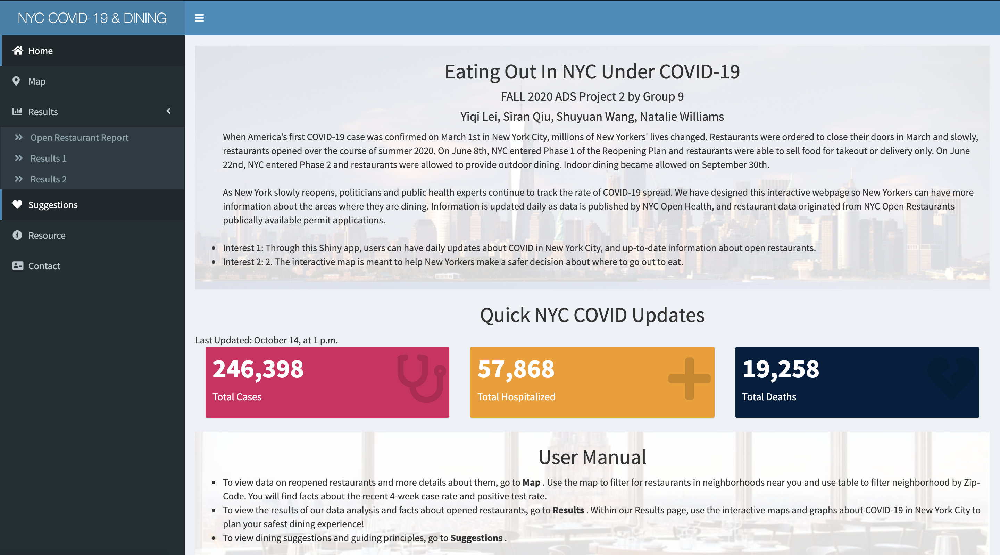
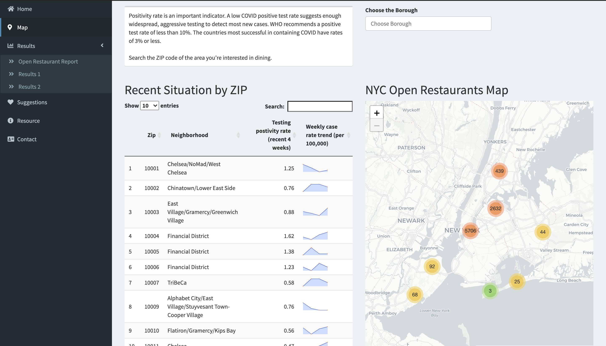
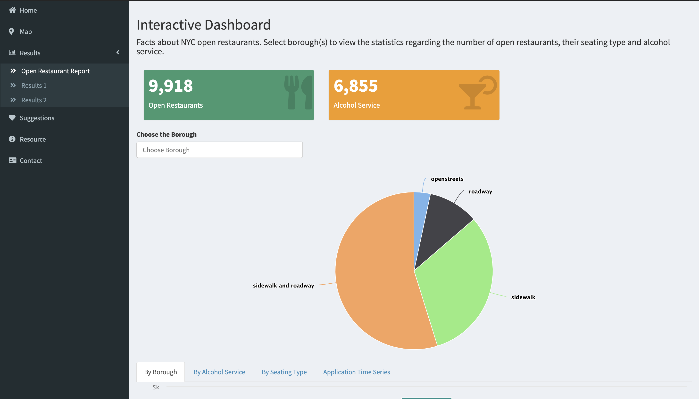
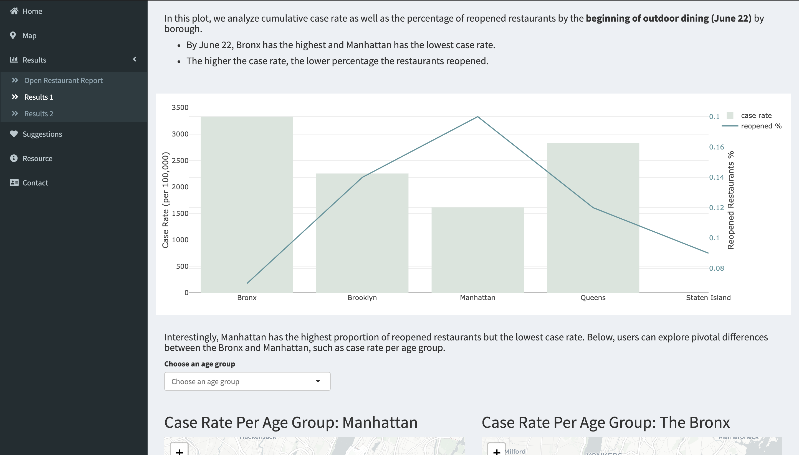
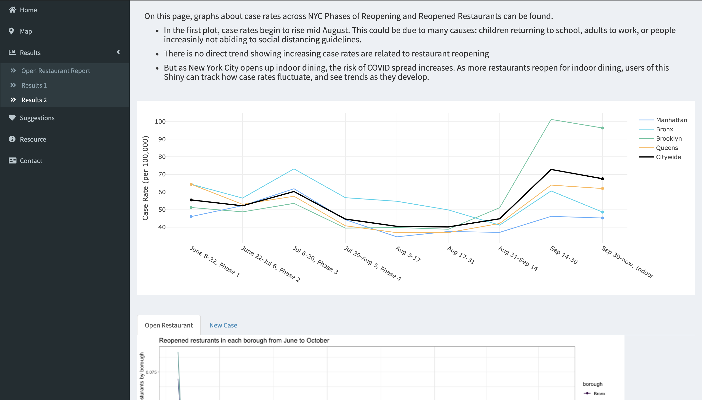
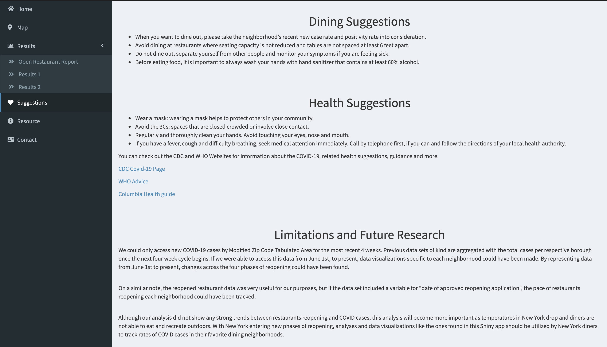

# Project 2: Shiny App Development









## NYC COVID-19 and Dining 
Term: Fall 2020

+ Team #9
+ **Team Members**: 
	+ Yiqi Lei
	+ Siran Qiu
	+ Shuyuan Wang
	+ Natalie Williams
	
+ Shiny Link: https://sw3449.shinyapps.io/covid-nyc-dining/

+ Update on 11/13/2020: Since [nychealth](https://github.com/nychealth/coronavirus-data) made significant changes to the COVID data repo, including some key files, filenames, and locations, urls for data used in this Shiny APP were no longer valid. Thus this Shiny APP cannot be updated daily and it is modified to the version that reporting COVID data till October 3, 2020.

+ **Project summary**: 

When America’s first COVID-19 case was confirmed on March 1st in New York City, millions of New Yorkers' lives changed. Restaurants were ordered to close their doors in March and slowly, restaurants reopened over the course of summer 2020. On June 8th, NYC entered Phase 1 of the Reopening Plan and restaurants were able to sell food for takeout or delivery only. On June 22nd, NYC entered Phase 2 and restaurants were allowed to provide outdoor dining. Indoor dining became allowed on September 30th.

We have designed this interactive Shiny App to help New Yorkers make a safer decision about where to go out to eat. Users can find up-to-date information about COVID Cases and restaurants in a given neighborhood in New York City. In the **Map** page, you can use the map to look for restaurants in neighborhoods near you, search by Zip-Code to find facts about the recent 4-week case rate and positive test rate, and sort the table by variables. In the **Results** page, you can view the results of our data analysis and facts about opened restaurants. In the **Suggestions** page, you can view dining suggestions and guiding principles. Use our maps and graphs about COVID-19 in New York City to plan your safest dining experience!

Information is updated daily as data is published by NYC Open Health, and restaurant data originated from NYC Open Restaurants are publically available for applications.


+ **Contribution statement**: 

All team members contributed equally in all stages of this project. All team members approve our work presented in this GitHub repository including this contribution statement.

Yiqi Lei: Designed and built the Shiny App structure and user interface, and debugged deployment errors, and updated README file.

Siran Qiu: Created the open restaurant and new case animations.

Shuyuan Wang: Generated the Map page, interactive dashboards and two plots for analysis, and participated in some of the written part.

Natalie Williams: Contributed to the written part, and produced the heatmaps of case and restaurant count by borough.


Following [suggestions](http://nicercode.github.io/blog/2013-04-05-projects/) by [RICH FITZJOHN](http://nicercode.github.io/about/#Team) (@richfitz). This folder is orgarnized as follows.

```
proj/
├── app/
├── lib/
├── data/
├── doc/
└── output/
```

Please see each subfolder for a README file.

